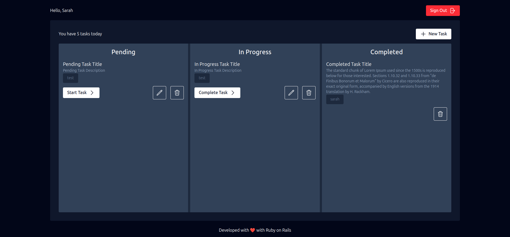

<h1 align="center"> Task Manager </h1>

<p align="center">
Task Manager is a web application designed to help teams manage their daily tasks, categorize them by status, and track their progress.<br/>
</p>

<p align="center">
  <a href="#-technologies">Technologies</a>&nbsp;&nbsp;&nbsp;|&nbsp;&nbsp;&nbsp;
  <a href="#-deploy">Run Locally</a>&nbsp;&nbsp;&nbsp;&nbsp;&nbsp;&nbsp;
</p>

<p align="center">
  
</p>

## 🚀 Technologies
- Ruby on Rails
- JavaScript
- jQuery
- AJAX
- HTML5
- TailwindCSS
- PostgreSQL
- RSpec 
- FactoryBot 
- Devise 

### 📋 Features
- User Authentication: Users can sign up, log in, and manage their sessions using Devise.
- Task Management: Users can create, edit, and delete tasks.
- Task Filtering: Tasks can be filtered by status: "Pending", "In Progress", and "Completed".
- Real-time Updates: Task status updates and deletions are handled with AJAX, updating the UI without needing to refresh the page.
- Task Assignment: Users can assign tasks to themselves.
- Responsive UI: The application is fully responsive, thanks to TailwindCSS.

### 🗃️ Database Structure
> Tables

- Users:
  - id (integer): Primary key
  - email (string): User's email (unique)
  - password_digest (string): Encrypted password for authentication
  - created_at (datetime): Timestamp of when the user was created
  - updated_at (datetime): Timestamp of the last update to the user

- Tasks
  - id (integer): Primary key
  - title (string): Title of the task
  - description (text): Description of the task
  - status (string): Status of the task (pending, in-progress, completed)
  - user_id (integer): Foreign key referencing the user who created the task
  - created_at (datetime): Timestamp of task creation
  - updated_at (datetime): Timestamp of the last update to the task

### ⚙️ Running Tests
To run tests for this project, make sure you have RSpec set up:

- Run the tests
```bash
rails test
```

- You can also run specific tests using:
```bash
rspec <path>
```

## 💻 Run Locally

> To run the project locally, you must have `RUBY` and `RAILS` installed on your computer.

* Ruby version used: 3.1.0
* Rails version used: 7.0.4
* PostgreSQL for database management

### Steps to Run Locally

1. Clone the Repository

```bash
git clone 
```

2. Install dependencies with Bundler
```bash
bundle install
```

3. Set up your database
```bash
rails db:create
rails db:migrate
```

4. Set up your database
```bash
rails s
```

5. Now you can visit the <a href="http://localhost:3000">application</a> and start creating users and tasks!

<br/><br/>

---
### Developed by Sarah Schneider 🖖